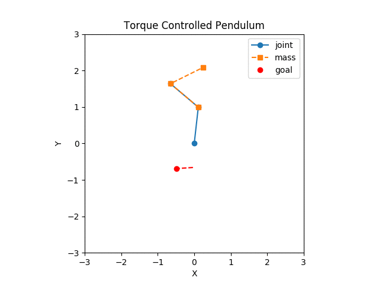

# rigmech

python rigid body analytic mechanics with sympy and urdf

 

## Features

* Imports from urdf and/or creates generic models of rigid bodies.
* Calculates analytic forms of common dynamics equations such as Jacobians and transforms.
* Provides several static helper methods for common transforms.
* Uses syntax similar to a urdf file.

## Demo

```python
# Initialize a rigmech:
Robot = rigmech()

# Add joints (constraints/actuations) and links (masses) to the mechanism:
Robot.addJoint(**joint_parameters)
Robot.addLink(**link_parameters)

# Or load a mechanism directly from a urdf file (can still be modified after
# loading):
Robot.loadURDF("my_robot.urdf")

# Which gives access to:
Robot.Joints       # (OrderedDict): Joint parameters (same as in urdf)
Robot.Links        # (OrderedDict): link parameters (same as in urdf)

# Once the mechanism is created, the Jacobians and transformations can be
# generated (using sympy):
Robot.generateEqns()

# generateEqns() gives access to:
Robot.joint_syms # (dict): symbols and equations defined relative to each joint
Robot.global_syms # (dict): symbols and equations relating to the global mechanism

# To see what symbols are available for a specific joint, try:
print(list(Robot.joint_syms["KneeJoint"].keys()))
# >>> = ['mass', 'M', 'q', 'dq', 'qTau', 'q_rpy', 'q_xyz', 'Tlocal_joint',
#  'T_joint2cLink', 'Tlocal_link', 'Tlocal_joint_inv', 'Tlocal_link_inv',
#  'T_joint', 'T_link', 'T_inv_joint', 'T_inv_link', 'xyz_joint', 'xyz_link',
#  'xyz_coj', 'xyz_com', 'W', 'Wxyz_joint', 'Wxyz_link', 'Wxyz_coj', 'Wxyz_com',
#  'J_joint', 'J_link', 'J_com', 'J_coj', 'Mq', 'qFext', 'func_M',
#  'func_Tlocal_joint', 'func_T_joint2cLink', 'func_Tlocal_link',
#  'func_Tlocal_joint_inv', 'func_Tlocal_link_inv', 'func_T_joint', 'func_T_link',
#  'func_T_inv_joint', 'func_T_inv_link', 'func_xyz_joint', 'func_xyz_link',
#  'func_xyz_coj', 'func_xyz_com', 'func_W', 'func_Wxyz_joint', 'func_Wxyz_link',
#  'func_Wxyz_coj', 'func_Wxyz_com', 'func_J_joint', 'func_J_link', 'func_J_com',
#  'func_J_coj', 'func_Mq', 'func_qFext']

# To see what symbols are available for the global mechanism, try:
print(list(Robot.global_syms.keys()))
# >>> = ['Jname2q', 'q2Jname', 'Lname2parentJname', 'Jname2parentJname', 'dof',
#  'q', 'dq', 'qTau', 'xyz', 'Wxyz', 'extAccel', 'Mq', 'qFext', 'qFrict',
#  'xyz_com', 'mass', 'Cq', 'qFCoriolis', 'func_Mq', 'func_qFext',
#  'func_xyz_com', 'func_Cq', 'func_qFCoriolis']

# Any lamda function equation will be prepended by "func_" and have help pages:
help(Robot.global_syms["func_Mq"])  # joint space inertia (mass) matrix

# To simulate the mechanism, try:
q, dq, ddq = Robot.ForwardDynamics(dt, q, dq, qForceJoints, xyzFictitiousAccels)

# In addition, since for large mechanisms, the equations can take awhile to
# calculate analytically (especially if the Simplify=True option is used),
# the rigmech instance's data can be saved and loaded, here is a usage example:
Robot = rigmech("your_robot_name")
if not Robot.load():  # if couldn't load from your_robot_name.bin
    Robot.loadURDF("your_robot.urdf")
    Robot.generateEqns(Simplify=True)
    Robot.save()  # saves data to your_robot_name.bin
```
